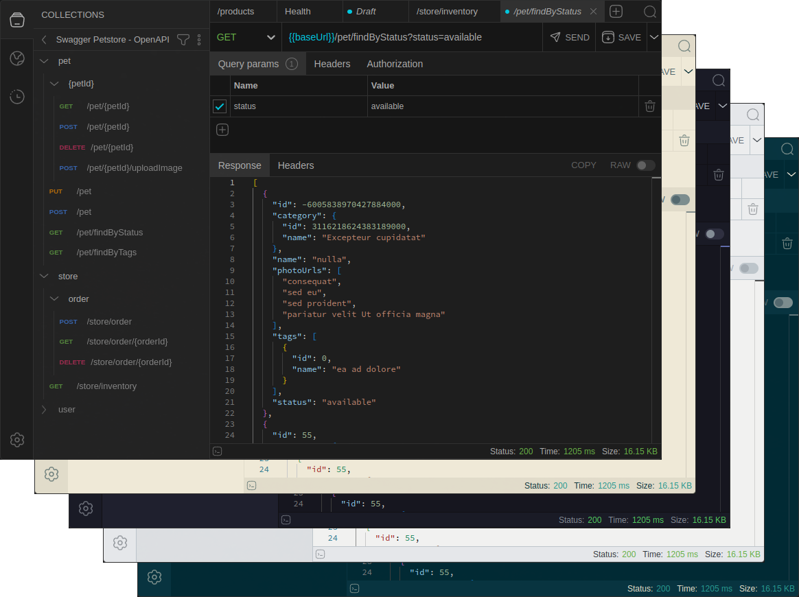

# API Calls

Simple application to call REST APIs.



## Project Setup

### Install

```bash
npm install
```

### Development

```bash
npm run dev
```

### Build

```bash
# For windows
$ npm run build:win

# For mac
$ npm run build:mac

# For Linux
$ npm run build:linux
```
